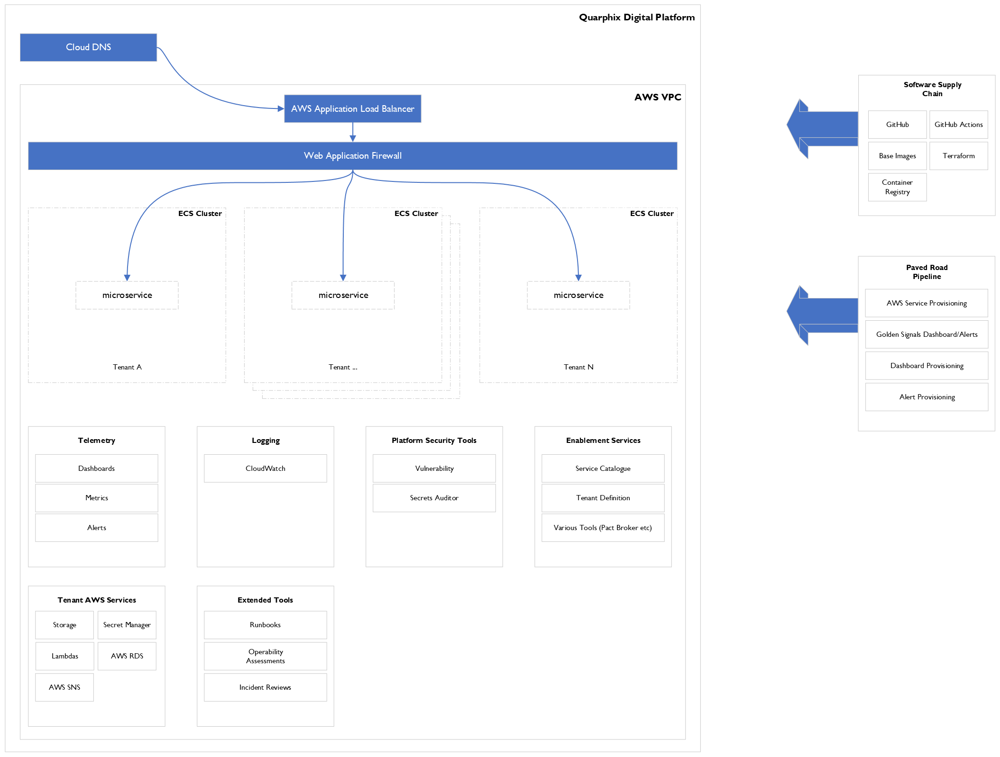

## Name

Quarphix Digital Platform

## Description

Codebase hosting the Quarphix Digital Platform

## Badges


## Visuals



## Support

The starting point to get help
is [Quarphix Digital Platform Site](https://quarphixcorp.sharepoint.com/sites/QuarphixDigitalPlatform)

## Roadmap

For more information about what is coming See the Monday.com [board](https://codeadvanced.monday.com/boards/1249598600)

## Contributing

Coming Soon.

### export AWS Environment variables

```shell
export AWS_ACCESS_KEY_ID=$(aws configure get my_profile.aws_access_key_id)
export AWS_SECRET_ACCESS_KEY=$(aws configure get my_profile.aws_secret_access_key)
```

## Authors and acknowledgment

- Charles Tumwebaze

## License

Internal

## Project status

Active